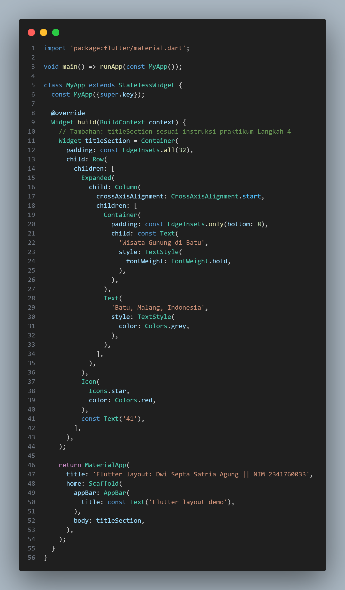
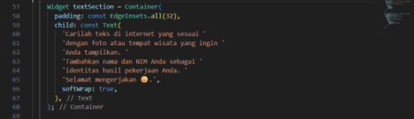
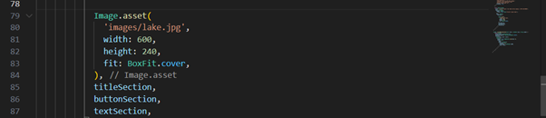
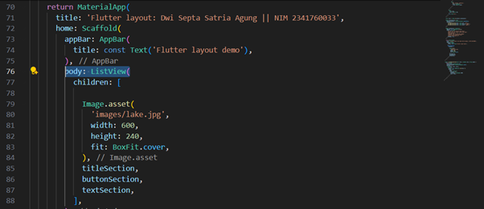

# Laporan Praktikum Pemrograman Mobile - Pertemuan 5

**PERTEMUAN-5 LAYOUT & NAVIGASI**

---

**Disusun Oleh:**

-   [cite_start]**Nama:** DWI SEPTA SATRIA AGUNG [cite: 5]
-   [cite_start]**NIM:** 2341760033 [cite: 6]
-   [cite_start]**Program Studi:** D-IV SISTEM INFORMASI BISNIS [cite: 7]
-   [cite_start]**Jurusan:** TEKNOLOGI INFORMASI [cite: 8]
-   [cite_start]**Politeknik:** POLITEKNIK NEGERI MALANG [cite: 9]
-   [cite_start]**Tahun:** 2025 [cite: 11]

---

## Tujuan Praktikum

Setelah menyelesaikan codelab ini, praktikan mampu untuk:
* Memahami cara kerja mekanisme tata letak Flutter.
* Menata widget secara vertikal dan horizontal.
* Membuat tata letak Flutter.

---

## Praktikum 1: Membangun Layout di Flutter

### Langkah 1-2: Buat Project Baru & Modifikasi `main.dart`

[cite_start]Membuat project baru dengan nama `layout_flutter`[cite: 14]. File `lib/main.dart` kemudian dimodifikasi untuk menambahkan Nama dan NIM pada `title`[cite: 15, 16].

[cite_start]*Gambar 1: Kode awal main.dart.* 

### Langkah 4: Implementasi `titleSection`

[cite_start]Mengimplementasikan `titleSection` sebagai variabel `Widget` di dalam method `build()`[cite: 20, 21].

[cite_start]*Gambar 2: Kode implementasi titleSection.* 

---

## Praktikum 2: Implementasi button row

### Langkah 1: Buat method `_buildButtonColumn`

[cite_start]Membuat method helper `_buildButtonColumn` untuk membangun satu kolom yang berisi ikon dan teks[cite: 24, 27, 28].

[cite_start]*Gambar 3: Kode method helper _buildButtonColumn.* 

### Langkah 2: Buat widget `buttonSection`

Membuat widget `buttonSection` yang berisi `Row` dengan 3 kolom tombol (CALL, ROUTE, SHARE) menggunakan method `_buildButtonColumn`[cite: 29, 31, 32, 34].

*Gambar 4: Kode implementasi buttonSection.* 

### Langkah 3: Tambah `buttonSection` ke `body`

Menambahkan variabel `buttonSection` ke dalam `children` dari `Column` di `body`[cite: 35, 36].

*Gambar 5: Menambahkan buttonSection ke body.* 

---

## Praktikum 3: Implementasi text section

### Langkah 1: Buat widget `textSection`

Membuat variabel `textSection` yang berisi `Container` dengan `padding` dan widget `Text`[cite: 39, 40, 41].

*Gambar 6: Kode implementasi textSection.* 

### Langkah 2: Tambahkan `textSection` ke `body`

Menambahkan variabel `textSection` ke dalam `children` dari `Column` di `body`[cite: 42, 43].

*Gambar 7: Menambahkan textSection ke body.* 

---

## Praktikum 4: Implementasi image section

### Langkah 1: Siapkan aset gambar

Membuat folder `images` dan mendaftarkan aset gambar di file `pubspec.yaml`[cite: 47, 48].

*Gambar 8: Mendaftarkan aset gambar di pubspec.yaml.* 

### Langkah 2: Tambahkan gambar ke `body`

Menambahkan `Image.asset` ke dalam `children` dari `Column` di `body`, di atas `titleSection`[cite: 49, 50].

*Gambar 9: Menambahkan widget Image.asset ke body.* 

### Langkah 3: Ubah menjadi `ListView`

Mengganti widget `Column` pada `body` menjadi `ListView` agar konten aplikasi dapat di-*scroll*[cite: 52, 53].

*Gambar 10: Mengganti Column dengan ListView.* 

---

## Hasil Akhir Praktikum

Tampilan akhir aplikasi setelah semua *section* (image, title, button, text) digabungkan di dalam `ListView`.

*Gambar 11: Tampilan akhir aplikasi layout.* 

---

## Link Repository GitHub

-   [cite_start][septasatria20/layout_flutter](https://github.com/septasatria20/layout_flutter) [cite: 54]